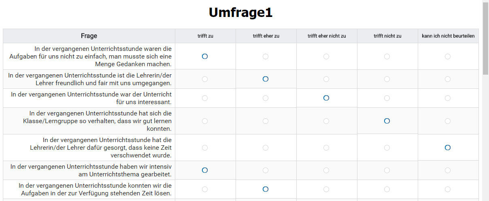

# Umfrage Server/Client
## Server
### Vorbereitungen
Zunächst müssen die notwendigen Komponenten installiert werden.
```
cd Server
npm install
```
### Starten des Servers
Nach der Installation der Pakete kann der Server gestertet werden.
```
npm start
```
Der Server läuft standradmäßig auf Port 3000, über http://localhost:3000 kann abgefragt werden ob der Server ordnungsgemäß läuft.
## Client
Auch hier müssen zunächst die notwendigen Module geladen werden.
```
cd Client
npm install
```
Der Client ist eine Angualr CLI Anwendung und kann wie folgt gestartet werden.
```
ng serve
```
Anschließend kann der Client aufgerufen werden via http://localhost:4200
## Durchführen einer Umfrage
Zum Durchführen einer Umfrage steht das Powershell CMDlet umfrage.ps1 zur Verfügung. Dieses Benötigt das Modul *Mdbc* um auf die MongoDB zugreifen zu können, dieses kann einfach über
```ps1
Import-Module Mdbc
```
importtiert werden. Wir das Script gestartet stehen folgende CMDLets zur Verfügung:
- Import-Question
- Import-Answer
- New-Poll
- New-Subscriber
- Invite-Subscriber

Die Funktionen sind alle mit Hilfstexten versehen und So kann über *Get-Help New-Subscriber* diese abgefragt werden.

Im Folgenden will ich kurz das Durchführen einer Umfrage beschreiben.
### Import der Fragen
Am besten befinden sich die Fragen in einer Excel Tabelle mit folgender Struktur.

row | question
--- | ---
1 | Hier eine Frage |
2 | Hier noch eine Frage |


Diese Fragen könne einfach über *Import-Question* importtiert werden.
```ps
Import-Excel fragen.xlsx | Import-Question -Polltype bho -mongoDB mongodb://localhost:27017/ 
```
Wobei *Polltype* der Type der Umfrage ist und *mongoDB* der Connectionstring zur Datenbank. Default heißt die Datenbank *umfrage* und es wir eine Collection *Q{polltype}* angelegt.
### Import der Antworskalen
In ähnlicher Weise können die Antwortskalen importiert werden. Diese befinden sich günstiger Weise auch in einer Excel Tabelle mit folgenden Aussehen:

row | answer | item 
--- | --- | ---
1 | Volle Zustimmung | 5 |
2 | Zustimmung| 4 |

Itemwerte <0 werden dabei in der Auswertung nicht berücksichtig und eignen sich z.B. für Felder wie "Enthaltung".

Diese Antworten könne einfach über *Import-Answer* importiert werden.
```ps
Import-Excel antworten.xlsx | Import-Answer -Polltype bho -mongoDB mongodb://localhost:27017/ 
```
Wobei *Polltype* der Type der Umfrage ist und *mongoDB* der Connectionstring zur Datenbank. Default heißt die Datenbank *umfrage* und es wir eine Collection *A{polltype}* angelegt.
### Importieren und Anschreiben der Teilnehmer
Zum Erzeugen und Anschreiben der Teilnehmer dienen die CMDlet *New-Subscriber* und *Invite-Subscriber*. Diese erzeugen einen neuen Teilnehmer und senden ihm eine EMail. Der Text der EMail könnte z.B. so lauten:
```html
Liebe Schülerinnen und Schüler,
hiermit möchte ich euch einladen an der Umfrage <b>{poll}</b> teilzunehmen. Ihr erreicht die Umfrage über folgenden Link:

<a href="http://localhost:4200/bho/{id}">Umfrage</a>

Mit freundlichen Grüßen
```
Beim senden der EMail werden *{poll}* und *{id}* sowohl im Betreff als auch im Inhalt der Mail ersetzt durch die entsprechenden Werte. Am einfachsten man erzeugt die Teilnehmer über eine Pipeline. Diese wird "gefüttert" mit den einzuladenden EMail Adressen (z.B. aus der AD).
```ps
"test1@test.de","test2@test.de" | New-Subscriber -Course FIAE17J -Poll "Schülerumfrage SJ1718" -Polltype bho | Invite-Subscriber -Text (get-Content email.txt -Encoding UTF8) -SMTPServer "smtp.uni-hannover.de:587" -SMTPUser user -SMTPPassword geheim
```
Diese Pipeline führt dazu, dass für die Teilnehmer mit den EMail Adressen "test1@test.de" und "test2@test.de" ein neuer Eintrag in die Collection *R{polltype}*, hier *Rbho* getätigt wird. Zuvor wird eine eindeutige ID generiert. Die Teilnehmer erhalten dann die oben dargestellte EMail über den gewählten SMTP Server zugesandt.
### Freischalten der Umfrage
Über das CMDlet *New-Poll* kann die Umfrage gestartet werden, bzw. auch ein Kennwort für die Auswertung der Umfrage vergeben werden. Wird das CMDlet in dieser Weise gestartet,
```ps
New-Poll -Polltype bho -Enable $true -Poll Umfrage2 -Password geheim -mongoDB mongodb://localhost:27017/ 

```
wird eine Umfrage mit dem Namen **Umfrage2** vom Type **bho** freigeschaltet und das Kennwort **geheim** für die spätere Auswertung vergeben. Diese Daten werden in der Collection *C{polltype}* gespeichert.

# Screenshots
Teilnehmeransicht (Durchführen der Umfrage)


Auswertung der Umfrage


